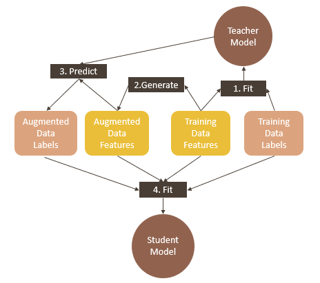

# Distillation with Reliable Augmeneted Data

  

## Abstract
Model distillation of complex but accurate model ensembles into fast and simple models can benefit from a data augmentation strategy that aims to reduce the teacher-student error. 
FAST-DAD [[1]](#references) suggested a data augmentation scheme, specific for tabular data that uses Gibbs sampling from a self-attention pseudolikelihood estimator. 
Instead of drawing samples from the full joint distribution, we suggest a simpler and faster approach- sampling directly from the conditionals estimates. In addition, we introduce the use of prediction sets to obtain reliable augmented samples for distillation. 
We observe that our proposed sampling scheme, is slightly better but is much faster and simpler with the potential of further improving performance by feature-specific augmentations.

## Our Work
In this work, we wanted to address some of the observed limitations in [[1]](#references):
  1. We present a comparison between two sampling methods. The first is the Gibbs sampler, which is presented in the paper. The second sampling scheme, is sampling from the conditional distributions estimates, which can be done in several ways. One way is to run all samples (or batches of samples), and for each batch randomly pick a feature $i$ and estimate its conditional distribution. Then, we can use this estimate to sample a 1-dim value of the feature $i$ given all other features in that sample. This kind of sampling technique should have a few advantages over Gibbs. First, given that the pseudolikelihood estimated are accurate, then the approximated samples should be very accurate as well, since it is merely sampling from a univariate distribution. Second, conditional sampling should faster than Gibbs sampling since it does not involve an iterative process of encoder predictions. Third, this strategy allows us to choose specific features to sample from, which can be helpful for augmenting certain features of interest or for finding hidden information that is not represented in the original data.
  2. One major limitation in FAST-DAD, and in knowledge distillation in general, is the fact the student's performance is bounded by the accuracy of teacher predictions. Being able to provide reliable predictions by the teacher, could potentially improve the distillation error. Therefore, we suggest using conformal prediction by the teacher. Conformal prediction can be used for any black-box algorithm and can be applied on several tasks, such as classification [[2]](#references) and regression [[3]](#references). Therefore, it sounds appealing to use this technique as a part of the generic framework of FAST-DAD.

  

  <em> Distillation with augmented data. The process of generating unlabled data for training is achieved by estimating the univariate conditional distribution for each feature and using Gibbs sampling to draw approximate samples from the joint distribution of the features. </em>

## Results

  
  

  <em> ROC-AUC vs. the number of augmented samples used for distillation (as a multiplication
of the original training set size). (left) gibbs sampling (right) conditional distributions sampling. The results are on the Phoneme dataset. </em>

  

  <em> Sampling time in seconds per 1k random samples vs. the number of features. 
    The evident plateau (in COND) is due to a simultaneous estimation of all conditionals by the encoder. 
    In the Gibbs sampling case (GIB-1), we do however expect a slight increase with the number of features because of its iterative nature. </em>

## References
[[1]](https://arxiv.org/abs/2006.14284) Rasool Fakoor, Jonas Mueller, Nick Erickson, Pratik Chaudhari, and Alexan-
der J. Smola. *Fast, Accurate, and Simple Models for Tabular Data via Augmented
Distillation*

[[2]](https://arxiv.org/abs/2006.02544) Yaniv Romano, Matteo Sesia, and Emmanuel Candes. *Classification with
Valid and Adaptive Coverage*

[[3]](https://arxiv.org/abs/1905.03222) Yaniv Romano, Evan Patterson, and Emmanuel J. Candès. *Conformalized Quantile Regression*

